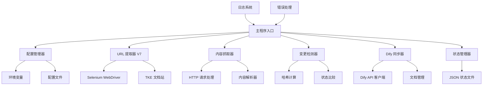

# 设计文档

## 概述

本设计文档描述了 TKE 文档到 Dify 知识库同步脚本的增强方案。系统将在现有 V7 URL 提取功能基础上，增强内容抓取的健壮性、实现可靠的变更检测、优化 Dify API 集成，并提供完整的自动化部署方案。

## 架构设计

### 系统架构图



### 核心组件

1. **配置管理器 (ConfigManager)**：统一管理所有配置项
2. **URL 提取器 (URLExtractor)**：保持现有 V7 版本不变
3. **内容抓取器 (ContentScraper)**：增强错误处理的内容抓取
4. **变更检测器 (ChangeDetector)**：基于哈希的变更检测
5. **Dify 同步器 (DifySync)**：智能的文档同步管理
6. **状态管理器 (StateManager)**：原子性状态文件操作
7. **日志系统 (Logger)**：统一的日志记录

## 组件和接口设计

### 1. 配置管理器 (ConfigManager)

```python
class ConfigManager:
    def __init__(self):
        self.config = {}
    
    def load_config(self) -> Dict[str, str]:
        """加载配置，优先级：环境变量 > .env 文件"""
        
    def validate_config(self) -> bool:
        """验证必需配置项是否存在"""
        
    def get(self, key: str, default=None) -> str:
        """获取配置值"""
```

**配置项：**
- `DIFY_API_KEY`: Dify API 密钥
- `DIFY_KNOWLEDGE_BASE_ID`: Dify 知识库 ID（支持单个或逗号分隔的多个 ID）
- `DIFY_API_BASE_URL`: Dify API 基础 URL
- `REQUEST_TIMEOUT`: HTTP 请求超时时间（默认 10 秒）
- `RETRY_ATTEMPTS`: API 重试次数（默认 3 次）
- `RETRY_DELAY`: 重试延迟时间（默认 1 秒）
- `KNOWLEDGE_BASE_STRATEGY`: 多知识库策略（'all', 'primary', 'round_robin'，默认 'primary'）

### 2. 内容抓取器 (ContentScraper)

```python
class ContentScraper:
    def __init__(self, config: ConfigManager):
        self.config = config
        self.session = requests.Session()
    
    def scrape_content(self, url: str) -> Optional[str]:
        """抓取并清洗指定 URL 的核心内容"""
        
    def _extract_content(self, soup: BeautifulSoup) -> Optional[str]:
        """从 BeautifulSoup 对象中提取内容"""
        
    def _handle_request_error(self, url: str, error: Exception) -> None:
        """处理请求错误"""
```

**错误处理策略：**
- 网络超时：记录日志，返回 None
- HTTP 4xx/5xx：记录状态码，返回 None  
- 解析错误：记录警告，返回 None
- 选择器未找到：记录警告，返回 None

### 3. 变更检测器 (ChangeDetector)

```python
class ChangeDetector:
    def __init__(self):
        pass
    
    def get_content_hash(self, content: str) -> str:
        """计算内容的 MD5 哈希值"""
        
    def detect_changes(self, url: str, content: str, old_state: Dict) -> str:
        """检测内容变更，返回变更类型：'new', 'modified', 'unchanged'"""
```

### 4. Dify 同步器 (DifySync)

```python
class DifySync:
    def __init__(self, config: ConfigManager):
        self.config = config
        self.api_base = config.get('DIFY_API_BASE_URL')
        self.api_key = config.get('DIFY_API_KEY')
        self.kb_ids = self._parse_knowledge_base_ids(config.get('DIFY_KNOWLEDGE_BASE_ID'))
        self.strategy = config.get('KNOWLEDGE_BASE_STRATEGY', 'primary')
        self.current_kb_index = 0
    
    def sync_document(self, url: str, content: str) -> bool:
        """同步文档到 Dify 知识库"""
        
    def _parse_knowledge_base_ids(self, kb_config: str) -> List[str]:
        """解析知识库 ID 配置（支持单个或多个）"""
        
    def _select_knowledge_base(self) -> str:
        """根据策略选择目标知识库"""
        
    def _sync_to_knowledge_base(self, kb_id: str, url: str, content: str) -> bool:
        """同步文档到指定知识库"""
        
    def _get_knowledge_base_settings(self, kb_id: str) -> Dict:
        """获取知识库的处理设置（分段、索引、检索配置）"""
        
    def _classify_document_type(self, url: str, content: str) -> str:
        """根据 URL 和内容自动分类文档类型"""
        
    def _generate_metadata(self, url: str, content: str, doc_type: str) -> Dict:
        """生成文档元数据"""
        
    def _upload_document(self, kb_id: str, doc_name: str, content: str, metadata: Dict) -> bool:
        """上传新文档到指定知识库，包含元数据和处理配置"""
        
    def _update_document(self, kb_id: str, doc_id: str, content: str, metadata: Dict) -> bool:
        """更新指定知识库中的现有文档，包含元数据"""
        
    def _delete_document(self, kb_id: str, doc_id: str) -> bool:
        """删除指定知识库中的文档"""
        
    def _find_document_by_name(self, kb_id: str, doc_name: str) -> Optional[str]:
        """在指定知识库中根据名称查找文档 ID"""
        
    def _generate_document_name(self, url: str) -> str:
        """从 URL 生成文档名称"""
        
    def _handle_api_error(self, response: requests.Response) -> None:
        """处理 API 错误响应"""
```

**Dify API 集成策略：**
1. 文档标识：使用完整 URL 作为唯一标识符
2. 文档名称：从 URL 路径提取有意义的标题
3. 多知识库支持：
   - `primary`: 仅同步到第一个知识库（默认）
   - `all`: 同步到所有配置的知识库
   - `round_robin`: 轮询分配到不同知识库
4. 更新逻辑：先查找现有文档，存在则更新，不存在则创建
5. 文档处理配置：
   - 分段设置：继承知识库现有设置（通用或父子分段）
   - 索引方式：使用高质量索引
   - 检索设置：使用混合检索模式
6. 元数据管理：
   - 自动分类：根据 URL 路径和内容特征判断文档类型
   - 操作类文档：包含步骤、配置、API 等操作指导
   - 概述类文档：包含介绍、概念、架构等概念说明
7. 错误处理：认证失败停止处理，速率限制实施退避重试
8. 临时文件：使用安全的临时文件创建和清理
9. 知识库故障转移：当主知识库不可用时，自动切换到备用知识库

### 5. 状态管理器 (StateManager)

```python
class StateManager:
    def __init__(self, state_file: str):
        self.state_file = state_file
    
    def load_state(self) -> Dict[str, str]:
        """加载状态文件"""
        
    def save_state(self, state: Dict[str, str]) -> None:
        """原子性保存状态文件"""
        
    def _atomic_write(self, data: Dict[str, str]) -> None:
        """原子性写入，防止中断时文件损坏"""
```

**状态文件格式：**
```json
{
  "https://cloud.tencent.com/document/product/457/xxx": "md5_hash_value",
  "last_update": "2024-01-01T00:00:00Z",
  "total_documents": 800
}
```

### 6. 日志系统 (Logger)

```python
import logging
from datetime import datetime

class TKELogger:
    def __init__(self, log_file: str = "tke_sync.log"):
        self.logger = logging.getLogger('tke_sync')
        self._setup_logger(log_file)
    
    def _setup_logger(self, log_file: str) -> None:
        """配置日志格式和输出"""
        
    def log_summary(self, total: int, updated: int, failed: int) -> None:
        """记录执行摘要"""
```

**日志格式：**
```
2024-01-01 12:00:00 [INFO] [任务1] 成功获取到 800 个文档 URL
2024-01-01 12:01:00 [ERROR] [任务2] 抓取失败 https://example.com: 连接超时
2024-01-01 12:02:00 [INFO] [任务4] 成功同步文档: https://example.com
```

## 文档分类和元数据生成

### 文档类型分类规则

**操作类文档 (operation)**：
- URL 路径包含：`/api/`, `/guide/`, `/tutorial/`, `/howto/`, `/config/`
- 内容特征：包含代码块、命令行、配置示例、步骤列表
- 关键词：创建、配置、部署、安装、设置、使用、操作

**概述类文档 (overview)**：
- URL 路径包含：`/overview/`, `/intro/`, `/concept/`, `/architecture/`
- 内容特征：包含概念解释、架构图、功能介绍
- 关键词：介绍、概述、架构、原理、特性、功能

### 元数据提取规则

1. **分类 (category)**：从 URL 路径的第二级目录提取
   - 例：`/document/product/457/xxx` → `product-457`

2. **关键词 (keywords)**：从文档标题和内容中提取
   - 使用 TF-IDF 算法提取高频关键词
   - 过滤停用词和通用词汇

3. **难度级别 (difficulty_level)**：
   - `basic`：包含"入门"、"介绍"、"概述"等词汇
   - `intermediate`：包含"配置"、"部署"、"管理"等词汇  
   - `advanced`：包含"高级"、"优化"、"故障排除"等词汇

## 数据模型

### 配置数据模型

```python
@dataclass
class Config:
    dify_api_key: str
    dify_knowledge_base_ids: List[str]  # 支持多个知识库
    dify_api_base_url: str
    knowledge_base_strategy: str = "primary"
    request_timeout: int = 10
    retry_attempts: int = 3
    retry_delay: int = 1
    state_file: str = "crawl_state.json"
    log_file: str = "tke_sync.log"
```

### 文档数据模型

```python
@dataclass
class Document:
    url: str
    content: str
    hash: str
    title: str
    doc_type: str  # 'operation' 或 'overview'
    metadata: Dict[str, str]
    last_modified: datetime
    
@dataclass
class DocumentMetadata:
    doc_type: str  # 'operation' 或 'overview'
    source_url: str
    category: str  # 从 URL 路径提取的分类
    keywords: List[str]  # 从内容提取的关键词
    difficulty_level: str  # 'basic', 'intermediate', 'advanced'
    
@dataclass
class ProcessingConfig:
    segmentation_mode: str  # 'general' 或 'parent_child'
    indexing_mode: str  # 'high_quality'
    retrieval_mode: str  # 'hybrid'
    
@dataclass
class SyncResult:
    url: str
    success: bool
    knowledge_base_id: str
    doc_type: str
    error_message: Optional[str] = None
    action: str = ""  # 'created', 'updated', 'skipped'
    
@dataclass
class KnowledgeBaseStatus:
    kb_id: str
    available: bool
    processing_config: ProcessingConfig
    last_error: Optional[str] = None
    last_check: datetime = None
```

### 状态数据模型

```python
@dataclass
class SyncState:
    document_hashes: Dict[str, str]
    last_update: datetime
    total_documents: int
    last_sync_summary: Dict[str, int]
```

## 错误处理策略

### 1. 网络错误处理

- **连接超时**：记录日志，跳过当前 URL，继续处理
- **HTTP 错误**：根据状态码分类处理
  - 4xx：客户端错误，记录并跳过
  - 5xx：服务器错误，实施重试机制
- **DNS 解析失败**：记录错误，跳过当前 URL

### 2. API 错误处理

- **认证失败 (401)**：记录错误，终止程序
- **权限不足 (403)**：记录错误，跳过当前文档
- **速率限制 (429)**：实施指数退避重试
- **服务器错误 (5xx)**：重试机制，最多 3 次

### 3. 文件操作错误处理

- **状态文件损坏**：备份损坏文件，创建新状态
- **磁盘空间不足**：记录错误，优雅终止
- **权限不足**：记录错误，提示用户检查权限

### 4. 重试机制

```python
def retry_with_backoff(func, max_attempts=3, base_delay=1):
    """指数退避重试装饰器"""
    for attempt in range(max_attempts):
        try:
            return func()
        except RetryableError as e:
            if attempt == max_attempts - 1:
                raise
            delay = base_delay * (2 ** attempt)
            time.sleep(delay)
```

## 测试策略

### 1. 单元测试

- **配置管理器**：测试环境变量和配置文件加载
- **内容抓取器**：模拟各种网络错误情况
- **变更检测器**：测试哈希计算和比较逻辑
- **Dify 同步器**：模拟 API 响应和错误处理
- **状态管理器**：测试原子性写入和错误恢复

### 2. 集成测试

- **端到端流程**：完整的同步流程测试
- **错误恢复**：中断后的状态恢复测试
- **并发安全**：多实例运行的安全性测试

### 3. 性能测试

- **大量文档处理**：测试 800+ 文档的处理性能
- **内存使用**：监控长时间运行的内存占用
- **网络效率**：优化 HTTP 连接复用

## 部署架构

### 1. 服务器环境

- **操作系统**：CentOS/Ubuntu/TencentOS
- **Python 版本**：3.8+
- **浏览器**：Google Chrome (有头模式)
- **虚拟显示**：Xvfb (用于 cron 环境)

### 2. 目录结构

```
/opt/tke-sync/
├── tke_dify_sync.py          # 主脚本
├── requirements.txt          # Python 依赖
├── .env                      # 配置文件 (可选)
├── crawl_state.json         # 状态文件
├── tke_sync.log            # 日志文件
└── temp/                   # 临时文件目录
```

### 3. Cron 配置

```bash
# 每天凌晨 2 点执行同步
0 2 * * * cd /opt/tke-sync && export DISPLAY=:99 && Xvfb :99 -screen 0 1024x768x24 > /dev/null 2>&1 & export DIFY_API_KEY="your_key" && /usr/bin/python3 tke_dify_sync.py >> tke_sync.log 2>&1
```

### 4. 监控和告警

- **日志监控**：监控错误日志，及时发现问题
- **状态检查**：定期检查状态文件更新时间
- **磁盘空间**：监控日志文件和临时文件占用
- **进程监控**：确保 cron 任务正常执行

## 安全考虑

### 1. 凭据管理

- API 密钥通过环境变量或加密配置文件管理
- 配置文件权限设置为 600 (仅所有者可读写)
- 不在日志中记录敏感信息

### 2. 网络安全

- 使用 HTTPS 进行所有 API 调用
- 实施请求超时防止长时间挂起
- 验证 SSL 证书

### 3. 文件安全

- 临时文件使用安全的创建方式
- 及时清理临时文件
- 状态文件原子性写入防止损坏

### 4. 运行时安全

- 以非 root 用户运行
- 限制文件系统访问权限
- 实施资源使用限制