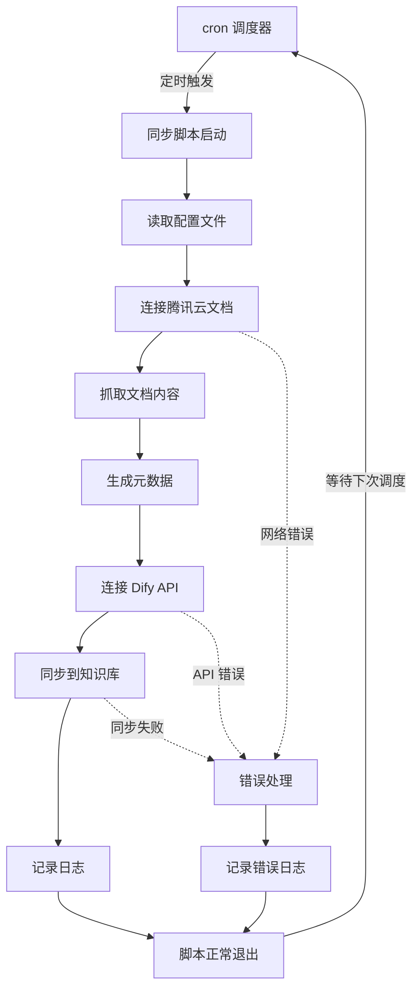
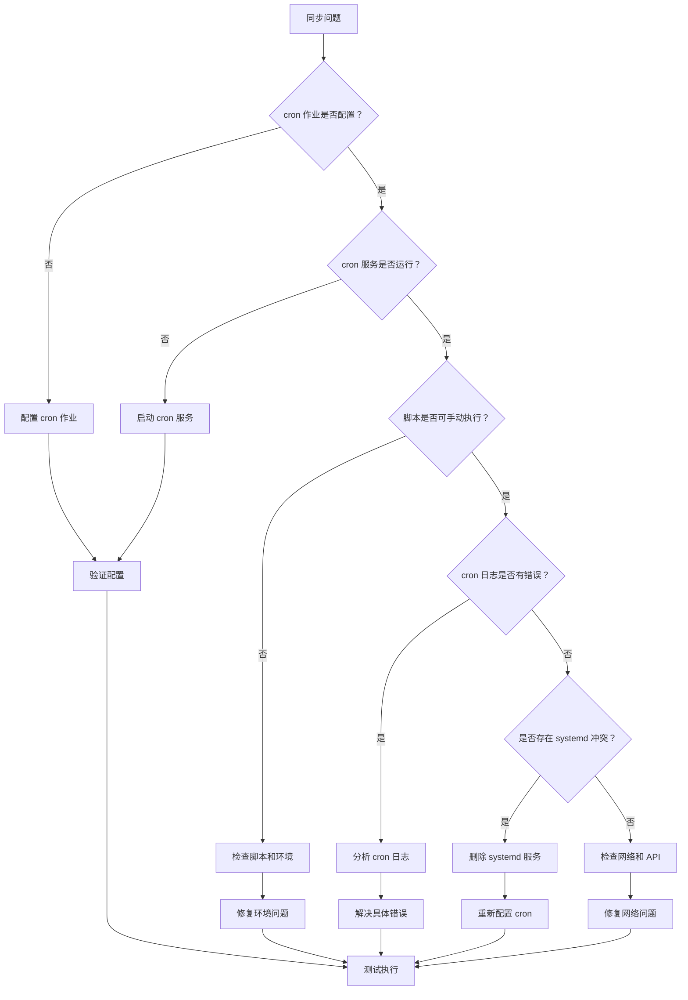

# TKE 文档同步系统 - 云端 CVM 部署指南

## 🎯 部署概述

本指南将帮助您在腾讯云 CVM 上部署 TKE 文档智能同步系统，实现自动化的文档抓取和同步到 Dify 知识库。

## 🔧 部署方法说明

### 核心架构理念

TKE 文档同步系统采用**定时同步**架构，设计为"运行一次，完成同步，然后退出"的工作模式。这种设计确保了：

- ✅ **资源效率**：只在需要时运行，不占用系统资源
- ✅ **稳定可靠**：避免长时间运行导致的内存泄漏或连接问题
- ✅ **易于维护**：每次运行都是全新的环境，问题容易定位
- ✅ **灵活调度**：可以根据需要调整同步频率

### 为什么使用 cron 而不是 systemd 服务？

| 对比项目 | cron 定时任务 ✅ | systemd 服务 ❌ |
|---------|-----------------|-----------------|
| **运行模式** | 定时执行，完成后退出 | 持续运行，异常退出时重启 |
| **资源使用** | 按需使用，执行时才占用资源 | 持续占用内存和 CPU |
| **适用场景** | 同步、备份、批处理任务 | Web 服务、数据库、API 服务 |
| **错误处理** | 单次执行失败不影响下次 | 重启循环可能导致资源浪费 |
| **维护难度** | 简单，日志清晰 | 复杂，需要处理服务状态 |

### 错误配置的后果

如果错误地将同步脚本配置为 systemd 服务（特别是使用 `Restart=always`），会导致：

```
脚本启动 → 完成同步 → 正常退出 → systemd 检测到退出 → 立即重启脚本 → 无限循环
```

这种配置会导致：
- 🚨 **无限重启循环**：脚本会不断重复执行
- 🚨 **资源浪费**：持续的 CPU 和网络使用
- 🚨 **API 限制**：可能触发目标网站的访问限制
- 🚨 **服务器负载**：可能导致服务器性能问题

### 正确的部署方式

本指南采用的正确方式：

1. **环境准备**：安装 Python、Chrome 等依赖
2. **项目部署**：下载代码，配置虚拟环境
3. **配置设置**：设置 Dify API 和知识库参数
4. **cron 调度**：配置定时任务，如每天凌晨 2 点执行
5. **监控日志**：设置日志轮转和健康检查

### 推荐的同步频率

根据不同需求选择合适的同步频率：

- **日常更新**：`0 2 * * *`（每天凌晨 2 点）
- **高频更新**：`0 */6 * * *`（每 6 小时一次）
- **周期更新**：`0 2 * * 1`（每周一凌晨 2 点）
- **多知识库**：错开时间，避免资源冲突

```bash
# 示例：多知识库错开调度
0 2 * * * # 基础文档库
0 3 * * * # 知识库
0 4 * * * # API 文档库
```

## 📋 系统要求

### 服务器配置
- **操作系统**: Ubuntu 20.04 LTS、CentOS 7+、TencentOS Server 2.4+ 或其他兼容发行版
- **CPU**: 2核心以上
- **内存**: 4GB 以上
- **存储**: 20GB 以上
- **网络**: 公网访问能力

### 软件依赖
- Python 3.8+
- Chrome/Chromium 浏览器
- Git

### 支持的操作系统
- **Ubuntu 20.04 LTS+**
- **CentOS 7+**
- **TencentOS Server 2.4+** (基于 CentOS)
- **Debian 10+**
- **Red Hat Enterprise Linux 7+**

## 🚀 一键部署脚本

### 1. 创建部署脚本

首先创建自动化部署脚本：

```bash
# 下载部署脚本
curl -O https://raw.githubusercontent.com/your-repo/tke-dify-sync/main/deploy.sh
chmod +x deploy.sh

# 运行部署脚本
./deploy.sh
```

### 2. 手动部署步骤

如果需要手动部署，请按以下步骤操作：

#### 步骤 1: 系统环境准备

```bash
# 更新系统包
sudo apt update && sudo apt upgrade -y

# 安装基础依赖
sudo apt install -y python3 python3-pip git curl wget unzip

# 安装 Chrome 浏览器
wget -q -O - https://dl.google.com/linux/linux_signing_key.pub | sudo apt-key add -
echo "deb [arch=amd64] http://dl.google.com/linux/chrome/deb/ stable main" | sudo tee /etc/apt/sources.list.d/google-chrome.list
sudo apt update
sudo apt install -y google-chrome-stable

# 验证安装
python3 --version
google-chrome --version
```

#### 步骤 2: 创建项目目录

```bash
# 创建项目目录
sudo mkdir -p /opt/tke-dify-sync
sudo chown $USER:$USER /opt/tke-dify-sync
cd /opt/tke-dify-sync

# 创建必要的子目录
mkdir -p {logs,data,config,scripts}
```

#### 步骤 3: 下载项目文件

```bash
# 方式一：从 Git 仓库克隆（推荐）
git clone https://github.com/your-repo/tke-dify-sync.git .

# 方式二：手动上传文件（如果没有 Git 仓库）
# 将以下文件上传到 /opt/tke-dify-sync/ 目录：
# - tke_dify_sync.py
# - dify_sync_manager.py
# - enhanced_metadata_generator.py
# - smart_retry_manager.py
# - tke_logger.py
# - secure_temp_manager.py
# - requirements.txt
# - .env.example
```

#### 步骤 4: 安装 Python 依赖

```bash
# 安装 pip 依赖
pip3 install -r requirements.txt

# 如果遇到权限问题，使用用户安装
pip3 install --user -r requirements.txt
```

## 📦 依赖包一键安装脚本

创建 `install_dependencies.sh` 脚本：

```bash
#!/bin/bash

echo "🚀 开始安装 TKE 文档同步系统依赖..."

# 检查操作系统
if [ -f /etc/os-release ]; then
    . /etc/os-release
    OS=$NAME
    VER=$VERSION_ID
else
    echo "❌ 无法检测操作系统版本"
    exit 1
fi

echo "📋 检测到操作系统: $OS $VER"

# Ubuntu/Debian 系统
if [[ "$OS" == *"Ubuntu"* ]] || [[ "$OS" == *"Debian"* ]]; then
    echo "🔧 安装 Ubuntu/Debian 依赖..."
    
    # 更新包列表
    sudo apt update
    
    # 安装基础依赖
    sudo apt install -y python3 python3-pip python3-venv git curl wget unzip
    
    # 安装 Chrome
    if ! command -v google-chrome &> /dev/null; then
        echo "📦 安装 Google Chrome..."
        wget -q -O - https://dl.google.com/linux/linux_signing_key.pub | sudo apt-key add -
        echo "deb [arch=amd64] http://dl.google.com/linux/chrome/deb/ stable main" | sudo tee /etc/apt/sources.list.d/google-chrome.list
        sudo apt update
        sudo apt install -y google-chrome-stable
    fi

# CentOS/RHEL/TencentOS 系统
elif [[ "$OS" == *"CentOS"* ]] || [[ "$OS" == *"Red Hat"* ]] || [[ "$OS" == *"TencentOS"* ]]; then
    if [[ "$OS" == *"TencentOS"* ]]; then
        echo "🔧 安装 TencentOS Server 依赖（兼容 CentOS 模式）..."
    else
        echo "🔧 安装 CentOS/RHEL 依赖..."
    fi
    
    # 安装 EPEL 仓库
    sudo yum install -y epel-release
    
    # 安装基础依赖
    sudo yum install -y python3 python3-pip git curl wget unzip
    
    # 安装 Chrome
    if ! command -v google-chrome &> /dev/null; then
        echo "📦 安装 Google Chrome..."
        sudo yum install -y https://dl.google.com/linux/direct/google-chrome-stable_current_x86_64.rpm
    fi
else
    echo "❌ 不支持的操作系统: $OS"
    exit 1
fi

# 创建虚拟环境（推荐）
echo "🐍 创建 Python 虚拟环境..."
python3 -m venv venv
source venv/bin/activate

# 升级 pip
pip install --upgrade pip

# 安装 Python 依赖
echo "📦 安装 Python 依赖包..."
pip install requests beautifulsoup4 selenium webdriver-manager

# 验证安装
echo "✅ 验证安装..."
python3 --version
google-chrome --version
pip list | grep -E "(requests|beautifulsoup4|selenium|webdriver-manager)"

echo "🎉 依赖安装完成！"
```

## ⚙️ 配置文件设置

### 1. 创建配置文件

```bash
# 复制配置模板
cp .env.example .env

# 编辑配置文件
nano .env
```

### 2. 配置文件内容

在 `.env` 文件中填入以下配置：

```bash
# === Dify API 配置 ===
DIFY_API_KEY=your_dify_api_key_here
DIFY_KNOWLEDGE_BASE_ID=your_knowledge_base_id_here
DIFY_API_BASE_URL=https://api.dify.ai/v1

# === 同步策略 ===
KB_STRATEGY=primary

# === 网络配置 ===
REQUEST_TIMEOUT=30
RETRY_ATTEMPTS=3
RETRY_DELAY=2

# === 文件配置 ===
STATE_FILE=/opt/tke-dify-sync/data/crawl_state.json
LOG_FILE=/opt/tke-dify-sync/logs/tke_sync.log

# === TKE 文档配置 ===
BASE_URL=https://cloud.tencent.com
START_URL=https://cloud.tencent.com/document/product/457
```

### 3. Dify 知识库准备

#### 步骤 1：创建知识库

1. **登录 Dify 控制台**
   - 访问 [Dify 控制台](https://dify.ai)
   - 使用您的账号登录

2. **创建新知识库**
   - 点击 "知识库" → "创建知识库"
   - 输入知识库名称（如："TKE技术文档库"）
   - 选择知识库类型："文档知识库"
   - 点击 "创建"

3. **配置知识库设置**
   - 进入知识库设置页面
   - 设置文档处理方式："自动处理"
   - 选择文本分割方式："智能分割"
   - 设置分割长度：500-1000 字符

#### 步骤 2：配置元数据字段（重要）

**为什么需要配置元数据？**
- 系统使用3个元数据字段来管理文档
- 支持智能哈希对比，避免重复同步
- 自动分类文档类型（操作类/概述类）

**配置步骤：**

1. **进入知识库设置**
   - 选择您创建的知识库
   - 点击 "设置" → "元数据字段"

2. **添加推荐的元数据字段**

   **字段 1：文档类型**
   - 字段名：`doc_type`
   - 字段类型：选择列表
   - 选项值：
     - `操作类文档`
     - `概述类文档`

   **字段 2：内容哈希**
   - 字段名：`content_hash`
   - 字段类型：文本
   - 描述：用于检测内容变更

   **字段 3：文档URL**
   - 字段名：`url`
   - 字段类型：文本
   - 描述：原始文档链接

3. **保存元数据配置**
   - 点击 "保存" 确认元数据字段配置
   - 确保所有字段都已正确创建

#### 步骤 3：获取配置信息

**获取 API Key：**
1. 在 Dify 控制台中，进入 "设置" → "API Keys"
2. 点击 "创建 API Key"
3. 输入 API Key 名称（如："TKE文档同步"）
4. 选择权限："数据集管理"
5. 复制生成的 API Key（格式：`dataset-xxxxxxxxxx`）

**确定 API 基础 URL：**

Dify API 基础 URL 会根据您的 Dify 部署方式而不同：

1. **Dify Cloud（官方云服务）**
   ```bash
   DIFY_API_BASE_URL=https://api.dify.ai/v1
   ```

2. **私有部署（自建服务器）**
   ```bash
   # 替换为您的实际域名和端口
   DIFY_API_BASE_URL=https://your-dify-domain.com/v1
   DIFY_API_BASE_URL=http://your-server-ip:port/v1
   ```

3. **企业版部署**
   ```bash
   # 联系您的系统管理员获取正确的 API 地址
   DIFY_API_BASE_URL=https://dify.your-company.com/v1
   ```

**如何确认 API 基础 URL：**
- 查看 Dify 控制台的 API 文档页面
- 在控制台的 "设置" → "API Keys" 页面通常会显示 API 端点
- 联系您的 Dify 管理员确认正确的 API 地址

**重要提醒：**
- 确保 API 基础 URL 以 `/v1` 结尾
- 如果使用 HTTPS，确保 SSL 证书有效
- 如果是内网部署，确保服务器能访问该地址

**获取知识库 ID：**
1. 进入您创建的知识库页面
2. 从浏览器 URL 中获取知识库 ID
   - URL 格式：`https://dify.ai/datasets/{knowledge_base_id}`
   - 知识库 ID 格式：`8c6b8e3c-f69c-48ea-b34e-a71798c800ed`
3. 复制知识库 ID 备用

#### 步骤 4：验证知识库配置

**测试知识库访问：**
```bash
# 使用 curl 测试 API 连接
curl -X GET \
  "https://api.dify.ai/v1/datasets/{your_knowledge_base_id}" \
  -H "Authorization: Bearer {your_api_key}" \
  -H "Content-Type: application/json"
```

**预期响应：**
```json
{
  "id": "your_knowledge_base_id",
  "name": "TKE技术文档库",
  "description": "...",
  "permission": "only_me",
  "data_source_type": "upload_file",
  "indexing_technique": "high_quality",
  "created_at": "..."
}
```

#### 多知识库场景

如果您需要多个知识库（如生产环境和测试环境），请重复上述步骤：

1. **tke_docs_base 知识库**
   - 名称："TKE基础文档库"
   - ID：`781c5e51-c317-4861-823e-143f13ab69ce`
   - 配置3个元数据字段

2. **tke_knowledge_base 知识库**
   - 名称："TKE知识库"
   - ID：`ee0c2549-96cd-4ff4-97ab-88c1704eae21`
   - 配置3个元数据字段

**重要提醒：**
- 每个知识库都需要配置相同的3个元数据字段
- 使用相同的 API Key：`dataset-m6r1gc2q4BKVKPKR0xy1KVPS`
- API 地址：`http://119.91.201.9/v1`

## 📁 文件部署结构

### 目录结构

```
/opt/tke-dify-sync/
├── tke_dify_sync.py              # 主程序
├── dify_sync_manager.py          # Dify 同步管理器
├── enhanced_metadata_generator.py # 元数据生成器
├── smart_retry_manager.py        # 智能重试管理器
├── tke_logger.py                 # 日志管理器
├── secure_temp_manager.py        # 临时文件管理器
├── requirements.txt              # Python 依赖
├── .env                          # 配置文件
├── .env.example                  # 配置模板
├── README.md                     # 说明文档
├── config/                       # 配置目录
│   ├── .env.production          # 生产环境配置
│   └── .env.backup              # 备份配置
├── data/                         # 数据目录
│   ├── crawl_state.json         # 爬取状态
│   └── temp/                    # 临时文件
├── logs/                         # 日志目录
│   ├── tke_sync.log             # 同步日志
│   └── error.log                # 错误日志
└── scripts/                      # 脚本目录
    ├── deploy.sh                # 部署脚本
    ├── start.sh                 # 启动脚本
    ├── stop.sh                  # 停止脚本
    └── monitor.sh               # 监控脚本
```

### 文件权限设置

```bash
# 设置目录权限
sudo chown -R $USER:$USER /opt/tke-dify-sync
chmod 755 /opt/tke-dify-sync
chmod 755 /opt/tke-dify-sync/{config,data,logs,scripts}

# 设置文件权限
chmod 644 /opt/tke-dify-sync/*.py
chmod 600 /opt/tke-dify-sync/.env
chmod 755 /opt/tke-dify-sync/scripts/*.sh
```

## 🔧 自动化配置详解

### 执行流程架构图



### 正确 vs 错误的部署方式对比

#### ✅ 正确方式：cron 定时任务

```bash
# crontab 配置
0 2 * * * cd /opt/tke-dify-sync && python tke_dify_sync.py

# 执行时间线
02:00 - 脚本启动
02:01 - 开始抓取文档
02:05 - 同步到 Dify
02:06 - 脚本退出，释放资源
...
次日 02:00 - 下次执行
```

**优势：**
- 🟢 按需执行，资源使用效率高
- 🟢 每次都是全新环境，避免状态污染
- 🟢 失败不影响下次执行
- 🟢 易于调试和维护

#### ❌ 错误方式：systemd 服务

```bash
# 错误的 systemd 配置
[Service]
ExecStart=/opt/tke-dify-sync/venv/bin/python tke_dify_sync.py
Restart=always  # 这是问题所在！

# 实际执行效果
02:00:00 - 服务启动
02:00:01 - 开始抓取文档
02:00:05 - 同步到 Dify
02:00:06 - 脚本正常退出
02:00:06 - systemd 检测到退出，立即重启！
02:00:07 - 服务重新启动
02:00:08 - 又开始抓取文档...
# 无限循环！
```

**问题：**
- 🔴 无限重启循环，浪费资源
- 🔴 可能被目标网站识别为攻击
- 🔴 日志文件快速增长
- 🔴 服务器负载过高

### 多知识库配置策略

当需要同步多个知识库时，推荐使用**时间错开**策略：

```bash
# 方案一：每日错开执行
0 2 * * * # tke_docs_base（基础文档）
0 3 * * * # tke_knowledge_base（知识库）
0 4 * * * # tke_api_docs（API 文档）

# 方案二：不同频率执行
0 2 * * *   # 基础文档（每天）
0 2 * * 1   # 知识库（每周一）
0 2 1 * *   # API 文档（每月 1 号）
```

### 监控和维护策略

#### 自动监控

```bash
# 监控 cron 作业（每 5 分钟检查一次）
*/5 * * * * /opt/tke-dify-sync/scripts/monitor.sh

# 健康检查（每小时）
0 * * * * /opt/tke-dify-sync/scripts/health_check.sh

# 日志清理（每周日）
0 1 * * 0 find /opt/tke-dify-sync/logs -name "*.log" -mtime +7 -delete
```

#### 手动维护

```bash
# 查看执行状态
./scripts/log_analyzer.sh -s

# 检查系统健康
./scripts/health_check.sh

# 分析最近错误
./scripts/log_analyzer.sh -e -d 3

# 手动测试执行
./scripts/start.sh
```

## 📊 监控和日志

### 1. 日志查看

```bash
# 查看实时日志
sudo journalctl -u tke-dify-sync -f

# 查看应用日志
tail -f /opt/tke-dify-sync/logs/tke_sync.log

# 查看错误日志
tail -f /opt/tke-dify-sync/logs/error.log
```

### 2. 监控脚本

创建 `scripts/monitor.sh`：

```bash
#!/bin/bash

SERVICE_NAME="tke-dify-sync"
LOG_FILE="/opt/tke-dify-sync/logs/monitor.log"

# 检查 cron 作业状态
check_cron_status() {
    # 检查 cron 作业是否配置
    if crontab -l 2>/dev/null | grep -q "tke_dify_sync"; then
        echo "$(date): ✅ cron 作业已配置" >> $LOG_FILE
        return 0
    else
        echo "$(date): ⚠️ cron 作业未配置" >> $LOG_FILE
        return 1
    fi
    
    # 检查最近的执行记录
    if [ -f "/opt/tke-dify-sync/logs/cron.log" ]; then
        local last_execution=$(stat -c %Y "/opt/tke-dify-sync/logs/cron.log" 2>/dev/null || echo 0)
        local current_time=$(date +%s)
        local hours_since=$((($current_time - $last_execution) / 3600))
        
        if [ $hours_since -lt 25 ]; then  # 25小时内有执行
            echo "$(date): ✅ 最近有执行记录（${hours_since}小时前）" >> $LOG_FILE
        else
            echo "$(date): ⚠️ 超过24小时未执行（${hours_since}小时前）" >> $LOG_FILE
        fi
    fi
}

# 检查磁盘空间
check_disk_space() {
    USAGE=$(df /opt/tke-dify-sync | awk 'NR==2 {print $5}' | sed 's/%//')
    if [ $USAGE -gt 80 ]; then
        echo "$(date): ⚠️ 磁盘使用率过高: ${USAGE}%" >> $LOG_FILE
    fi
}

# 执行检查
check_service
check_disk_space
```

### 3. 定时任务

```bash
# 编辑 crontab
crontab -e

# 添加监控任务（每5分钟检查一次）
*/5 * * * * /opt/tke-dify-sync/scripts/monitor.sh

# 添加日志清理任务（每天凌晨清理7天前的日志）
0 0 * * * find /opt/tke-dify-sync/logs -name "*.log" -mtime +7 -delete
```

## 🔄 多知识库配置方案

### 方案一：单知识库配置（推荐新手）
使用单个 `.env` 文件配置一个知识库。

### 方案二：多知识库相同配置
在单个 `.env` 文件中配置多个知识库 ID：
```bash
# 多个知识库使用相同配置
DIFY_KNOWLEDGE_BASE_ID=kb1-id,kb2-id,kb3-id
KB_STRATEGY=all  # 同步到所有知识库
```

### 方案三：多知识库不同配置（推荐生产环境）

**适用场景：**
- 不同知识库有不同用途（技术文档库、用户手册库、API文档库）
- 不同环境部署（开发、测试、生产）
- 需要独立的状态文件和日志文件

**实施步骤：**

1. **创建多个配置文件**

**`.env.tke_docs_base`** (TKE基础文档库):
```bash
# tke_docs_base 知识库配置
DIFY_API_KEY=dataset-m6r1gc2q4BKVKPKR0xy1KVPS
DIFY_KNOWLEDGE_BASE_ID=781c5e51-c317-4861-823e-143f13ab69ce
DIFY_API_BASE_URL=http://119.91.201.9/v1
KB_STRATEGY=primary

# 独立的状态和日志文件
STATE_FILE=/opt/tke-dify-sync/data/crawl_state_tke_docs_base.json
LOG_FILE=/opt/tke-dify-sync/logs/tke_sync_tke_docs_base.log

# 网络配置
REQUEST_TIMEOUT=60
RETRY_ATTEMPTS=5
RETRY_DELAY=3
```

**`.env.tke_knowledge_base`** (TKE知识库):
```bash
# tke_knowledge_base 知识库配置
DIFY_API_KEY=dataset-m6r1gc2q4BKVKPKR0xy1KVPS
DIFY_KNOWLEDGE_BASE_ID=ee0c2549-96cd-4ff4-97ab-88c1704eae21
DIFY_API_BASE_URL=http://119.91.201.9/v1
KB_STRATEGY=primary

# 独立的状态和日志文件
STATE_FILE=/opt/tke-dify-sync/data/crawl_state_tke_knowledge_base.json
LOG_FILE=/opt/tke-dify-sync/logs/tke_sync_tke_knowledge_base.log

# 网络配置（更快的响应）
REQUEST_TIMEOUT=30
RETRY_ATTEMPTS=3
RETRY_DELAY=2
```

2. **分别运行同步**
```bash
# 同步到 tke_docs_base 知识库
cp .env.tke_docs_base .env && python tke_dify_sync.py

# 同步到 tke_knowledge_base 知识库
cp .env.tke_knowledge_base .env && python tke_dify_sync.py
```

3. **创建批量同步脚本**
```bash
# 创建多知识库同步脚本
cat > /opt/tke-dify-sync/scripts/sync_all_kb.sh << 'EOF'
#!/bin/bash
cd /opt/tke-dify-sync
source venv/bin/activate

echo "开始多知识库同步..."

# 同步到 tke_docs_base
echo "同步到 TKE基础文档库..."
cp .env.tke_docs_base .env
python tke_dify_sync.py

# 同步到 tke_knowledge_base
echo "同步到 TKE知识库..."
cp .env.tke_knowledge_base .env
python tke_dify_sync.py

echo "多知识库同步完成！"
EOF

chmod +x /opt/tke-dify-sync/scripts/sync_all_kb.sh
```

4. **配置定时任务**

#### 基础配置（推荐）

```bash
# 编辑 crontab
crontab -e

# 添加以下内容：
# tke_docs_base 每天凌晨2点同步
0 2 * * * cd /opt/tke-dify-sync && cp .env.tke_docs_base .env && /opt/tke-dify-sync/venv/bin/python tke_dify_sync.py >> /opt/tke-dify-sync/logs/cron_tke_docs_base.log 2>&1

# tke_knowledge_base 每天凌晨3点同步
0 3 * * * cd /opt/tke-dify-sync && cp .env.tke_knowledge_base .env && /opt/tke-dify-sync/venv/bin/python tke_dify_sync.py >> /opt/tke-dify-sync/logs/cron_tke_knowledge_base.log 2>&1
```

#### 高级配置选项

**选项 A：不同频率同步**
```bash
# 基础文档库 - 每天同步（内容更新频繁）
0 2 * * * cd /opt/tke-dify-sync && cp .env.tke_docs_base .env && /opt/tke-dify-sync/venv/bin/python tke_dify_sync.py >> /opt/tke-dify-sync/logs/cron_tke_docs_base.log 2>&1

# 知识库 - 每周同步（内容相对稳定）
0 3 * * 1 cd /opt/tke-dify-sync && cp .env.tke_knowledge_base .env && /opt/tke-dify-sync/venv/bin/python tke_dify_sync.py >> /opt/tke-dify-sync/logs/cron_tke_knowledge_base.log 2>&1

# API 文档库 - 每月同步（更新较少）
0 4 1 * * cd /opt/tke-dify-sync && cp .env.tke_api_docs .env && /opt/tke-dify-sync/venv/bin/python tke_dify_sync.py >> /opt/tke-dify-sync/logs/cron_tke_api_docs.log 2>&1
```

**选项 B：高频同步（适用于重要文档）**
```bash
# 基础文档库 - 每6小时同步
0 */6 * * * cd /opt/tke-dify-sync && cp .env.tke_docs_base .env && /opt/tke-dify-sync/venv/bin/python tke_dify_sync.py >> /opt/tke-dify-sync/logs/cron_tke_docs_base.log 2>&1

# 知识库 - 每12小时同步
0 */12 * * * cd /opt/tke-dify-sync && cp .env.tke_knowledge_base .env && /opt/tke-dify-sync/venv/bin/python tke_dify_sync.py >> /opt/tke-dify-sync/logs/cron_tke_knowledge_base.log 2>&1
```

**选项 C：工作时间同步**
```bash
# 工作日上午9点和下午6点同步
0 9,18 * * 1-5 cd /opt/tke-dify-sync && cp .env.tke_docs_base .env && /opt/tke-dify-sync/venv/bin/python tke_dify_sync.py >> /opt/tke-dify-sync/logs/cron_tke_docs_base.log 2>&1

# 周末只在上午10点同步一次
0 10 * * 6,0 cd /opt/tke-dify-sync && cp .env.tke_knowledge_base .env && /opt/tke-dify-sync/venv/bin/python tke_dify_sync.py >> /opt/tke-dify-sync/logs/cron_tke_knowledge_base.log 2>&1
```

# tke_docs_base 每天凌晨2点同步
0 2 * * * cd /opt/tke-dify-sync && cp .env.tke_docs_base .env && /opt/tke-dify-sync/venv/bin/python tke_dify_sync.py >> /opt/tke-dify-sync/logs/cron_tke_docs_base.log 2>&1

# tke_knowledge_base 每天凌晨3点同步
0 3 * * * cd /opt/tke-dify-sync && cp .env.tke_knowledge_base .env && /opt/tke-dify-sync/venv/bin/python tke_dify_sync.py >> /opt/tke-dify-sync/logs/cron_tke_knowledge_base.log 2>&1
```

### 多知识库配置模板

#### 模板 1：企业级三层架构

适用于大型企业，按文档类型分层管理：

**`.env.production_docs`** (生产环境文档):
```bash
# 生产环境文档库 - 最高优先级
DIFY_API_KEY=dataset-your-production-key
DIFY_KNOWLEDGE_BASE_ID=prod-docs-kb-id
DIFY_API_BASE_URL=https://your-dify-api.com/v1
KB_STRATEGY=primary

# 高可靠性配置
REQUEST_TIMEOUT=120
RETRY_ATTEMPTS=5
RETRY_DELAY=5
STATE_FILE=/opt/tke-dify-sync/data/crawl_state_production.json
LOG_FILE=/opt/tke-dify-sync/logs/tke_sync_production.log
```

**`.env.development_docs`** (开发环境文档):
```bash
# 开发环境文档库 - 快速迭代
DIFY_API_KEY=dataset-your-dev-key
DIFY_KNOWLEDGE_BASE_ID=dev-docs-kb-id
DIFY_API_BASE_URL=https://your-dify-api.com/v1
KB_STRATEGY=primary

# 快速响应配置
REQUEST_TIMEOUT=30
RETRY_ATTEMPTS=3
RETRY_DELAY=2
STATE_FILE=/opt/tke-dify-sync/data/crawl_state_development.json
LOG_FILE=/opt/tke-dify-sync/logs/tke_sync_development.log
```

**`.env.api_reference`** (API 参考文档):
```bash
# API 参考文档库 - 技术文档
DIFY_API_KEY=dataset-your-api-key
DIFY_KNOWLEDGE_BASE_ID=api-ref-kb-id
DIFY_API_BASE_URL=https://your-dify-api.com/v1
KB_STRATEGY=primary

# 标准配置
REQUEST_TIMEOUT=60
RETRY_ATTEMPTS=4
RETRY_DELAY=3
STATE_FILE=/opt/tke-dify-sync/data/crawl_state_api_reference.json
LOG_FILE=/opt/tke-dify-sync/logs/tke_sync_api_reference.log
```

#### 模板 2：多环境部署

适用于开发、测试、生产环境分离：

**`.env.staging`** (测试环境):
```bash
# 测试环境配置
DIFY_API_KEY=dataset-staging-key
DIFY_KNOWLEDGE_BASE_ID=staging-kb-id
DIFY_API_BASE_URL=https://staging-dify.your-company.com/v1
KB_STRATEGY=primary

# 测试环境特殊配置
REQUEST_TIMEOUT=45
RETRY_ATTEMPTS=2
RETRY_DELAY=1
STATE_FILE=/opt/tke-dify-sync/data/crawl_state_staging.json
LOG_FILE=/opt/tke-dify-sync/logs/tke_sync_staging.log

# 测试环境可以更激进的抓取策略
CRAWL_DELAY=1
MAX_PAGES=1000
```

#### 对应的 cron 配置

**企业级三层架构调度：**
```bash
# 生产文档 - 每天凌晨2点（避开业务高峰）
0 2 * * * cd /opt/tke-dify-sync && cp .env.production_docs .env && /opt/tke-dify-sync/venv/bin/python tke_dify_sync.py >> /opt/tke-dify-sync/logs/cron_production.log 2>&1

# 开发文档 - 每4小时（快速迭代需求）
0 */4 * * * cd /opt/tke-dify-sync && cp .env.development_docs .env && /opt/tke-dify-sync/venv/bin/python tke_dify_sync.py >> /opt/tke-dify-sync/logs/cron_development.log 2>&1

# API 文档 - 每周一凌晨3点（相对稳定）
0 3 * * 1 cd /opt/tke-dify-sync && cp .env.api_reference .env && /opt/tke-dify-sync/venv/bin/python tke_dify_sync.py >> /opt/tke-dify-sync/logs/cron_api_reference.log 2>&1
```

**多环境部署调度：**
```bash
# 测试环境 - 每2小时（频繁测试）
0 */2 * * * cd /opt/tke-dify-sync && cp .env.staging .env && /opt/tke-dify-sync/venv/bin/python tke_dify_sync.py >> /opt/tke-dify-sync/logs/cron_staging.log 2>&1

# 生产环境 - 每天凌晨1点（稳定可靠）
0 1 * * * cd /opt/tke-dify-sync && cp .env.production_docs .env && /opt/tke-dify-sync/venv/bin/python tke_dify_sync.py >> /opt/tke-dify-sync/logs/cron_production.log 2>&1
```

### 多知识库最佳实践

#### 1. 时间调度策略

**避免资源冲突：**
```bash
# ✅ 正确：错开执行时间
0 2 * * * # 知识库 A
0 3 * * * # 知识库 B  
0 4 * * * # 知识库 C

# ❌ 错误：同时执行
0 2 * * * # 知识库 A
0 2 * * * # 知识库 B - 会与 A 冲突
0 2 * * * # 知识库 C - 会与 A、B 冲突
```

**考虑业务优先级：**
```bash
# 高优先级文档在业务低峰期执行
0 2 * * * # 核心业务文档（凌晨2点）
0 6 * * * # 一般业务文档（早上6点）
0 22 * * * # 参考文档（晚上10点）
```

#### 2. 日志管理策略

**独立日志文件：**
```bash
# 每个知识库使用独立的日志文件
/opt/tke-dify-sync/logs/
├── cron_production.log      # 生产环境日志
├── cron_development.log     # 开发环境日志
├── cron_api_reference.log   # API 文档日志
└── cron_staging.log         # 测试环境日志
```

**日志轮转配置：**
```bash
# 在 /etc/logrotate.d/tke-dify-sync 中配置
/opt/tke-dify-sync/logs/cron_*.log {
    daily
    missingok
    rotate 30
    compress
    delaycompress
    notifempty
    create 644 ubuntu ubuntu
}
```

#### 3. 监控和告警

**分别监控各知识库：**
```bash
# 创建专门的监控脚本
cat > /opt/tke-dify-sync/scripts/monitor_multi_kb.sh << 'EOF'
#!/bin/bash

# 监控所有知识库的执行状态
KNOWLEDGE_BASES=("production" "development" "api_reference" "staging")

for kb in "${KNOWLEDGE_BASES[@]}"; do
    echo "检查 $kb 知识库状态..."
    
    # 检查最近的执行日志
    log_file="/opt/tke-dify-sync/logs/cron_${kb}.log"
    if [ -f "$log_file" ]; then
        last_execution=$(stat -c %Y "$log_file" 2>/dev/null || echo 0)
        current_time=$(date +%s)
        hours_ago=$(( (current_time - last_execution) / 3600 ))
        
        if [ $hours_ago -lt 25 ]; then
            echo "✅ $kb: 最近 ${hours_ago} 小时前执行"
        else
            echo "⚠️ $kb: 超过 ${hours_ago} 小时未执行"
        fi
    else
        echo "❌ $kb: 日志文件不存在"
    fi
done
EOF

chmod +x /opt/tke-dify-sync/scripts/monitor_multi_kb.sh
```

**设置监控 cron 作业：**
```bash
# 每小时检查一次所有知识库状态
0 * * * * /opt/tke-dify-sync/scripts/monitor_multi_kb.sh >> /opt/tke-dify-sync/logs/multi_kb_monitor.log 2>&1
```

#### 4. 故障恢复策略

**自动重试机制：**
```bash
# 在 cron 作业中添加重试逻辑
0 2 * * * cd /opt/tke-dify-sync && cp .env.production_docs .env && /opt/tke-dify-sync/venv/bin/python tke_dify_sync.py >> /opt/tke-dify-sync/logs/cron_production.log 2>&1 || (sleep 300 && /opt/tke-dify-sync/venv/bin/python tke_dify_sync.py >> /opt/tke-dify-sync/logs/cron_production_retry.log 2>&1)
```

**失败通知：**
```bash
# 创建失败通知脚本
cat > /opt/tke-dify-sync/scripts/notify_failure.sh << 'EOF'
#!/bin/bash
KB_NAME="$1"
LOG_FILE="$2"

# 检查执行结果
if [ $? -ne 0 ]; then
    echo "$(date): $KB_NAME 同步失败" >> /opt/tke-dify-sync/logs/failures.log
    
    # 可以在这里添加邮件通知、Slack 通知等
    # mail -s "TKE Sync Failed: $KB_NAME" admin@company.com < "$LOG_FILE"
fi
EOF

chmod +x /opt/tke-dify-sync/scripts/notify_failure.sh
```

**优势：**
- ✅ 完全独立的配置管理
- ✅ 独立的状态文件，避免冲突
- ✅ 独立的日志文件，便于调试
- ✅ 可以针对不同知识库调整参数
- ✅ 支持不同的同步频率
- ✅ 灵活的监控和告警策略
- ✅ 完善的故障恢复机制

## 🚀 使用方法

### 1. 手动运行

```bash
# 进入项目目录
cd /opt/tke-dify-sync

# 激活虚拟环境
source venv/bin/activate

# 测试配置
python test_config.py

# 运行同步
python tke_dify_sync.py
```

### 2. 查看 cron 作业状态

```bash
# 查看已配置的 cron 作业
crontab -l | grep tke

# 查看 cron 执行日志
tail -f /opt/tke-dify-sync/logs/cron.log

# 手动测试执行
cd /opt/tke-dify-sync && ./scripts/start.sh

# 检查系统健康状态
./scripts/health_check.sh

# 分析执行日志
./scripts/log_analyzer.sh -s
```

### 3. 定时同步

```bash
# 编辑 crontab
crontab -e

# 添加定时任务（每天凌晨2点执行）
0 2 * * * cd /opt/tke-dify-sync && /opt/tke-dify-sync/venv/bin/python tke_dify_sync.py >> /opt/tke-dify-sync/logs/cron.log 2>&1

# 每6小时执行一次
0 */6 * * * cd /opt/tke-dify-sync && /opt/tke-dify-sync/venv/bin/python tke_dify_sync.py >> /opt/tke-dify-sync/logs/cron.log 2>&1
```

## 🔍 故障排除

### 🚨 快速诊断流程

使用以下流程快速定位问题：



### 🔧 一键诊断工具

在开始手动排查前，建议先运行自动诊断工具：

```bash
# 1. 全面健康检查
./scripts/health_check.sh

# 2. 分析部署状态
./scripts/analyze_deployment.sh

# 3. 验证 cron 配置
./scripts/validate_cron_setup.sh

# 4. 监控 cron 执行
./scripts/cron_monitor.sh
```

### 常见问题分类解决

#### 🔴 紧急问题（影响生产）

**问题：同步完全停止工作**

1. **立即检查**：
```bash
# 检查是否有进程卡死
ps aux | grep tke_dify_sync
# 如果有，杀死进程
pkill -f tke_dify_sync

# 检查磁盘空间
df -h /opt/tke-dify-sync

# 检查最近的错误
tail -50 /opt/tke-dify-sync/logs/*.log | grep -i error
```

2. **快速恢复**：
```bash
# 手动执行一次同步
cd /opt/tke-dify-sync && ./scripts/start.sh

# 如果成功，问题可能是临时的
# 如果失败，继续下面的详细排查
```

**问题：发现 systemd 和 cron 同时运行**

1. **立即停止 systemd 服务**：
```bash
sudo systemctl stop tke-dify-sync
sudo systemctl disable tke-dify-sync
sudo rm /etc/systemd/system/tke-dify-sync.service
sudo systemctl daemon-reload
```

2. **验证 cron 配置**：
```bash
crontab -l | grep tke
./scripts/validate_cron_setup.sh
```

#### 🟡 常见问题（功能异常）

**1. Chrome 浏览器问题**

*症状*：脚本启动时报告 Chrome 相关错误

*解决方案*：
```bash
# 检查 Chrome 是否安装
google-chrome --version

# 如果未安装，安装 Chrome
wget -q -O - https://dl.google.com/linux/linux_signing_key.pub | sudo apt-key add -
echo "deb [arch=amd64] http://dl.google.com/linux/chrome/deb/ stable main" | sudo tee /etc/apt/sources.list.d/google-chrome.list
sudo apt update && sudo apt install -y google-chrome-stable

# 安装缺失的依赖
sudo apt install -y libnss3 libgconf-2-4 libxss1 libappindicator1 libindicator7

# 测试 Chrome 是否可以启动
google-chrome --headless --no-sandbox --dump-dom https://www.google.com > /dev/null
```

**2. Python 环境问题**

*症状*：cron 执行时报告 Python 模块未找到

*解决方案*：
```bash
# 检查虚拟环境
ls -la /opt/tke-dify-sync/venv/bin/python

# 重新创建虚拟环境（如果损坏）
cd /opt/tke-dify-sync
rm -rf venv
python3 -m venv venv
source venv/bin/activate
pip install --upgrade pip
pip install -r requirements.txt

# 测试 Python 环境
/opt/tke-dify-sync/venv/bin/python -c "import requests, selenium, bs4; print('所有依赖正常')"
```

**3. 配置文件问题**

*症状*：脚本报告配置错误或 API 连接失败

*解决方案*：
```bash
# 检查配置文件是否存在
ls -la /opt/tke-dify-sync/.env*

# 验证配置文件格式
grep -v "^#" /opt/tke-dify-sync/.env | grep "="

# 测试 Dify API 连接
DIFY_URL=$(grep "^DIFY_API_BASE_URL=" /opt/tke-dify-sync/.env | cut -d'=' -f2)
DIFY_KEY=$(grep "^DIFY_API_KEY=" /opt/tke-dify-sync/.env | cut -d'=' -f2)
curl -H "Authorization: Bearer $DIFY_KEY" "$DIFY_URL/datasets"

# 使用配置验证工具
./scripts/validate_cron_setup.sh
```

**4. 权限和路径问题**

*症状*：cron 执行时报告权限拒绝或文件未找到

*解决方案*：
```bash
# 检查文件所有权
ls -la /opt/tke-dify-sync/

# 修复权限
sudo chown -R $USER:$USER /opt/tke-dify-sync
chmod 755 /opt/tke-dify-sync
chmod +x /opt/tke-dify-sync/scripts/*.sh
chmod 600 /opt/tke-dify-sync/.env*

# 确保日志目录可写
mkdir -p /opt/tke-dify-sync/logs
chmod 755 /opt/tke-dify-sync/logs

# 测试权限
sudo -u $USER /opt/tke-dify-sync/venv/bin/python /opt/tke-dify-sync/tke_dify_sync.py --help
```

**5. 网络连接问题**

*症状*：脚本报告无法连接到目标网站或 API

*解决方案*：
```bash
# 测试基本网络连接
ping -c 3 cloud.tencent.com
curl -I https://cloud.tencent.com

# 测试 Dify API 连接
DIFY_URL=$(grep "^DIFY_API_BASE_URL=" /opt/tke-dify-sync/.env | cut -d'=' -f2)
curl -I "$DIFY_URL"

# 检查防火墙设置
sudo ufw status
sudo iptables -L

# 检查 DNS 解析
nslookup cloud.tencent.com
nslookup $(echo $DIFY_URL | sed 's|https\?://||' | cut -d'/' -f1)

# 测试代理设置（如果使用代理）
echo $http_proxy $https_proxy
```

#### 🟢 cron 特定问题（调度相关）

**问题：cron 作业不执行**

*症状*：配置了 cron 作业但从未执行

*诊断步骤*：
```bash
# 1. 检查 cron 服务状态
sudo systemctl status cron
sudo systemctl status crond  # CentOS/RHEL

# 2. 检查 cron 作业是否正确配置
crontab -l
crontab -l | grep tke

# 3. 检查 cron 日志
sudo tail -f /var/log/cron        # CentOS/RHEL
sudo tail -f /var/log/syslog | grep CRON  # Ubuntu/Debian

# 4. 测试 cron 语法
echo "*/1 * * * * echo 'test-$(date)' >> /tmp/crontest.log" | crontab -
# 等待2分钟后检查
cat /tmp/crontest.log
# 清理测试
crontab -r
```

*解决方案*：
```bash
# 启动 cron 服务
sudo systemctl start cron
sudo systemctl enable cron

# 重新配置 cron 作业
crontab -e
# 添加正确的作业配置

# 验证配置
./scripts/validate_cron_setup.sh
```

**问题：cron 作业执行但脚本失败**

*症状*：cron 日志显示作业执行，但脚本报错

*诊断步骤*：
```bash
# 1. 检查 cron 执行日志
tail -f /opt/tke-dify-sync/logs/cron*.log

# 2. 比较手动执行和 cron 执行的环境
# 手动执行
cd /opt/tke-dify-sync && /opt/tke-dify-sync/venv/bin/python tke_dify_sync.py

# 模拟 cron 环境执行
env -i HOME="$HOME" PATH="/usr/bin:/bin" bash -c "cd /opt/tke-dify-sync && /opt/tke-dify-sync/venv/bin/python tke_dify_sync.py"

# 3. 检查环境变量差异
echo $PATH
# vs
* * * * * echo $PATH > /tmp/cron-path.log
```

*解决方案*：
```bash
# 在 cron 作业中使用完整路径
0 2 * * * cd /opt/tke-dify-sync && /opt/tke-dify-sync/venv/bin/python tke_dify_sync.py >> /opt/tke-dify-sync/logs/cron.log 2>&1

# 或者在 cron 作业开头设置环境
0 2 * * * export PATH="/usr/local/bin:/usr/bin:/bin" && cd /opt/tke-dify-sync && /opt/tke-dify-sync/venv/bin/python tke_dify_sync.py >> /opt/tke-dify-sync/logs/cron.log 2>&1
```

**问题：多知识库配置冲突**

*症状*：多个知识库同步时出现配置混乱或状态文件冲突

*诊断步骤*：
```bash
# 1. 检查配置文件
ls -la /opt/tke-dify-sync/.env*

# 2. 检查状态文件
ls -la /opt/tke-dify-sync/data/crawl_state*.json

# 3. 检查 cron 作业时间安排
crontab -l | grep tke_dify_sync

# 4. 分析日志文件
./scripts/log_analyzer.sh -a
```

*解决方案*：
```bash
# 确保每个知识库有独立的配置和状态文件
# 检查配置文件中的 STATE_FILE 和 LOG_FILE 设置

# 错开 cron 执行时间
0 2 * * * # 知识库 A
0 3 * * * # 知识库 B
0 4 * * * # 知识库 C

# 使用监控脚本检查冲突
./scripts/cron_monitor.sh
```

**问题：cron 作业执行时间过长**

*症状*：同步任务运行时间超过预期，可能影响下次执行

*诊断步骤*：
```bash
# 1. 检查当前运行的进程
ps aux | grep tke_dify_sync

# 2. 分析执行时间
./scripts/log_analyzer.sh -a | grep "执行时间\|duration"

# 3. 检查系统资源使用
top -p $(pgrep -f tke_dify_sync)
```

*解决方案*：
```bash
# 1. 优化同步参数
# 在 .env 文件中调整
REQUEST_TIMEOUT=30
RETRY_ATTEMPTS=3
CRAWL_DELAY=2

# 2. 分批处理大量文档
# 可以考虑分时段同步不同部分

# 3. 添加超时保护
timeout 3600 /opt/tke-dify-sync/venv/bin/python tke_dify_sync.py

# 4. 监控长时间运行的任务
*/30 * * * * if pgrep -f "tke_dify_sync.py" > /dev/null; then echo "$(date): 同步任务仍在运行" >> /opt/tke-dify-sync/logs/long_running.log; fi
```

### cron 特定调试步骤

#### 1. 验证 cron 作业配置

```bash
# 使用分析工具检查配置
./scripts/analyze_deployment.sh

# 验证 cron 设置
./scripts/validate_cron_setup.sh

# 检查是否存在冲突的 systemd 服务
sudo systemctl list-units | grep tke-dify
```

#### 2. 调试 cron 执行问题

```bash
# 手动模拟 cron 环境执行
env -i HOME="$HOME" PATH="/usr/bin:/bin" bash -c "cd /opt/tke-dify-sync && /opt/tke-dify-sync/venv/bin/python tke_dify_sync.py"

# 检查 cron 执行日志
tail -f /opt/tke-dify-sync/logs/cron.log

# 分析执行模式
./scripts/log_analyzer.sh -a

# 检查最近的执行状态
./scripts/cron_monitor.sh
```

#### 3. 常见 cron 问题解决

**问题：cron 作业不执行**
```bash
# 检查 cron 服务
sudo systemctl status cron
sudo systemctl restart cron

# 检查用户权限
sudo crontab -u $USER -l

# 检查系统日志
sudo grep CRON /var/log/syslog | tail -10
```

**问题：脚本在 cron 中执行失败，但手动执行成功**
```bash
# 比较环境变量
echo $PATH
# vs
* * * * * echo $PATH > /tmp/cron-path.log

# 在 cron 作业中添加调试信息
0 2 * * * cd /opt/tke-dify-sync && /opt/tke-dify-sync/venv/bin/python tke_dify_sync.py > /tmp/debug.log 2>&1

# 检查调试日志
cat /tmp/debug.log
```

**问题：多个知识库配置冲突**
```bash
# 检查配置文件切换
ls -la /opt/tke-dify-sync/.env*

# 验证配置文件内容
./scripts/validate_cron_setup.sh

# 检查状态文件冲突
ls -la /opt/tke-dify-sync/data/crawl_state*.json
```

### 日志分析和监控

#### 使用内置分析工具

```bash
# 生成系统健康报告
./scripts/health_check.sh

# 分析所有日志文件
./scripts/log_analyzer.sh -a

# 查看最近3天的错误
./scripts/log_analyzer.sh -e -d 3

# 生成摘要报告
./scripts/log_analyzer.sh -s

# 监控 cron 执行状态
./scripts/cron_monitor.sh
```

#### 手动日志分析

```bash
# 查看 cron 执行日志
tail -f /opt/tke-dify-sync/logs/cron*.log

# 查看应用程序日志
tail -f /opt/tke-dify-sync/logs/tke_sync.log

# 搜索错误信息
grep -i "error\|exception\|failed" /opt/tke-dify-sync/logs/*.log

# 查看成功执行记录
grep -i "success\|完成\|✅" /opt/tke-dify-sync/logs/*.log

# 分析执行频率
grep "开始同步" /opt/tke-dify-sync/logs/tke_sync.log | tail -10
```

#### 🎯 故障排除决策树

根据具体症状选择对应的解决路径：

#### 症状：同步从未执行过

```bash
# 检查流程
1. crontab -l | grep tke  # 是否配置了 cron 作业？
   └─ 如果没有 → 运行 ./scripts/validate_cron_setup.sh

2. sudo systemctl status cron  # cron 服务是否运行？
   └─ 如果没有 → sudo systemctl start cron

3. 手动测试执行
   cd /opt/tke-dify-sync && ./scripts/start.sh
   └─ 如果失败 → 检查环境和配置
```

#### 症状：同步执行但总是失败

```bash
# 检查流程
1. tail -50 /opt/tke-dify-sync/logs/cron*.log  # 查看错误信息
2. ./scripts/health_check.sh  # 运行健康检查
3. 根据错误类型：
   ├─ Chrome 错误 → 重新安装 Chrome 和依赖
   ├─ Python 错误 → 重建虚拟环境
   ├─ 网络错误 → 检查网络和防火墙
   └─ API 错误 → 验证 Dify 配置
```

#### 症状：同步有时成功有时失败

```bash
# 检查流程
1. ./scripts/log_analyzer.sh -e -d 7  # 分析最近7天的错误
2. ./scripts/cron_monitor.sh  # 检查执行模式
3. 检查系统资源：
   ├─ df -h  # 磁盘空间
   ├─ free -h  # 内存使用
   └─ 网络稳定性测试
```

### 🔧 常用故障排除命令速查表

#### 快速诊断命令

```bash
# 一键健康检查
./scripts/health_check.sh

# 分析部署状态
./scripts/analyze_deployment.sh

# 验证 cron 配置
./scripts/validate_cron_setup.sh

# 监控 cron 执行
./scripts/cron_monitor.sh

# 分析日志
./scripts/log_analyzer.sh -s  # 摘要
./scripts/log_analyzer.sh -e  # 只看错误
./scripts/log_analyzer.sh -a  # 分析所有日志
```

#### 系统状态检查

```bash
# cron 服务状态
sudo systemctl status cron
sudo systemctl status crond  # CentOS

# 查看 cron 作业
crontab -l
crontab -l | grep tke

# 查看 cron 日志
sudo tail -f /var/log/cron  # CentOS
sudo tail -f /var/log/syslog | grep CRON  # Ubuntu

# 检查进程
ps aux | grep tke_dify_sync
pgrep -f tke_dify_sync
```

#### 环境验证命令

```bash
# Python 环境
/opt/tke-dify-sync/venv/bin/python --version
/opt/tke-dify-sync/venv/bin/python -c "import requests, selenium, bs4"

# Chrome 浏览器
google-chrome --version
google-chrome --headless --no-sandbox --dump-dom https://www.google.com

# 网络连接
curl -I https://cloud.tencent.com
curl -I $(grep DIFY_API_BASE_URL /opt/tke-dify-sync/.env | cut -d'=' -f2)

# 配置文件
ls -la /opt/tke-dify-sync/.env*
grep -v "^#" /opt/tke-dify-sync/.env | grep "="
```

#### 日志分析命令

```bash
# 查看最新日志
tail -f /opt/tke-dify-sync/logs/cron*.log
tail -f /opt/tke-dify-sync/logs/tke_sync.log

# 搜索错误
grep -i "error\|exception\|failed" /opt/tke-dify-sync/logs/*.log
grep -i "success\|完成" /opt/tke-dify-sync/logs/*.log

# 统计执行次数
grep "开始同步" /opt/tke-dify-sync/logs/tke_sync.log | wc -l
grep "同步完成" /opt/tke-dify-sync/logs/tke_sync.log | wc -l
```

#### 紧急修复命令

```bash
# 停止所有相关进程
pkill -f tke_dify_sync

# 删除冲突的 systemd 服务
sudo systemctl stop tke-dify-sync 2>/dev/null || true
sudo systemctl disable tke-dify-sync 2>/dev/null || true
sudo rm /etc/systemd/system/tke-dify-sync.service 2>/dev/null || true
sudo systemctl daemon-reload

# 重置 cron 配置
crontab -r  # 小心：这会删除所有 cron 作业
# 然后重新配置

# 清理临时文件
find /opt/tke-dify-sync/temp -type f -mtime +1 -delete 2>/dev/null || true
find /opt/tke-dify-sync/logs -name "*.log" -size +100M -exec truncate -s 10M {} \;
```

### 系统级监控

```bash
# 检查系统资源使用
df -h /opt/tke-dify-sync
free -h
top -p $(pgrep -f tke_dify_sync)

# 检查网络连接
curl -I https://cloud.tencent.com
curl -I $(grep DIFY_API_BASE_URL /opt/tke-dify-sync/.env | cut -d'=' -f2)

# 检查进程状态
ps aux | grep tke_dify_sync
```

## 📈 性能优化

### 1. 系统优化

```bash
# 增加文件描述符限制
echo "* soft nofile 65536" | sudo tee -a /etc/security/limits.conf
echo "* hard nofile 65536" | sudo tee -a /etc/security/limits.conf

# 优化网络参数
echo "net.core.rmem_max = 16777216" | sudo tee -a /etc/sysctl.conf
echo "net.core.wmem_max = 16777216" | sudo tee -a /etc/sysctl.conf
sudo sysctl -p
```

### 2. 应用优化

在 `.env` 文件中调整参数：

```bash
# 增加超时时间
REQUEST_TIMEOUT=60

# 增加重试次数
RETRY_ATTEMPTS=5

# 调整重试延迟
RETRY_DELAY=3
```

## 🔐 安全配置

### 1. 防火墙设置

```bash
# 启用防火墙
sudo ufw enable

# 允许 SSH
sudo ufw allow ssh

# 允许 HTTP/HTTPS（如果需要）
sudo ufw allow 80
sudo ufw allow 443
```

### 2. 文件权限

```bash
# 保护配置文件
chmod 600 /opt/tke-dify-sync/.env

# 保护日志目录
chmod 750 /opt/tke-dify-sync/logs
```

## 📋 部署检查清单

- [ ] 系统环境准备完成
- [ ] Python 3.8+ 安装完成
- [ ] Chrome 浏览器安装完成
- [ ] 项目文件上传完成
- [ ] Python 依赖安装完成
- [ ] 配置文件设置完成
- [ ] Dify API Key 配置正确
- [ ] 知识库 ID 配置正确
- [ ] 文件权限设置正确
- [ ] cron 作业配置完成
- [ ] 监控脚本配置完成
- [ ] 定时任务配置完成
- [ ] 测试运行成功

## 🎉 部署完成

恭喜！您已成功在云端 CVM 上部署了 TKE 文档智能同步系统。

### 验证部署

#### 🔍 快速验证

```bash
# 进入项目目录
cd /opt/tke-dify-sync

# 1. 运行自动化验证脚本
./scripts/validate_cron_setup.sh

# 2. 运行健康检查
./scripts/health_check.sh

# 3. 运行快速测试套件
./scripts/run_all_tests.sh -f
```

#### 📋 手动验证步骤

```bash
# 1. 验证 Python 环境
source venv/bin/activate
python --version
pip list | grep -E "(requests|beautifulsoup4|selenium)"

# 2. 验证配置文件
cat .env | grep -E "(DIFY_API_KEY|DIFY_KNOWLEDGE_BASE_ID|DIFY_API_BASE_URL)"

# 3. 验证 cron 作业配置
crontab -l | grep tke
systemctl is-active cron

# 4. 验证脚本语法
python -m py_compile tke_dify_sync.py

# 5. 手动测试执行
./scripts/start.sh

# 6. 检查日志输出
ls -la logs/
tail -f logs/cron*.log
```

#### 🧪 完整测试验证

```bash
# 运行完整测试套件
./scripts/run_all_tests.sh

# 测试多知识库调度（如适用）
./scripts/test_multi_kb_scheduling.sh

# 测试日志轮转
./scripts/test_log_rotation.sh

# 验证迁移状态（确保无 systemd 冲突）
./scripts/validate_migration.sh
```

#### ✅ 验证检查清单

使用详细的部署验证检查清单确保所有组件正确配置：

```bash
# 查看完整检查清单
cat DEPLOYMENT_CHECKLIST.md

# 或在线查看
less DEPLOYMENT_CHECKLIST.md
```

#### 🚨 验证失败处理

如果验证失败，按以下步骤排查：

```bash
# 1. 运行诊断工具
./scripts/analyze_deployment.sh

# 2. 查看详细错误日志
tail -50 logs/*.log

# 3. 检查系统状态
./scripts/monitor.sh

# 4. 验证网络连接
curl -I https://cloud.tencent.com
curl -I $DIFY_API_BASE_URL

# 5. 重新运行特定测试
./scripts/test_cron_deployment.sh -v
```

### 🔧 后续维护

#### 定期维护任务

```bash
# 每周运行健康检查
./scripts/health_check.sh

# 每月运行完整测试
./scripts/run_all_tests.sh

# 查看系统状态
./scripts/monitor.sh

# 分析日志文件
./scripts/log_analyzer.sh
```

#### 监控要点

- **cron 作业执行状态**: `crontab -l` 和日志文件
- **系统资源使用**: 磁盘空间、内存使用
- **网络连接状态**: API 可达性
- **日志文件大小**: 防止磁盘空间耗尽
- **配置文件完整性**: 定期备份和验证

#### 维护脚本

```bash
# 清理旧日志文件
find logs/ -name "*.log" -mtime +7 -delete

# 备份配置文件
cp -r .env* backup/config_$(date +%Y%m%d)/

# 更新依赖包（谨慎操作）
source venv/bin/activate
pip list --outdated
```

#### 🆘 故障排除

如遇问题，请按以下顺序排查：

1. **查看故障排除部分**: 本文档的故障排除章节
2. **运行诊断工具**: `./scripts/analyze_deployment.sh`
3. **查看系统日志**: `journalctl -u cron --since "1 hour ago"`
4. **检查网络连接**: 验证 API 可达性
5. **联系技术支持**: 提供日志文件和错误信息

#### 📞 获取帮助

- **文档**: 查看 `DOCS_GUIDE.md` 了解使用说明
- **故障排除**: 参考本文档的故障排除部分
- **社区支持**: GitHub Issues 或技术论坛
- **专业支持**: 联系系统管理员或技术团队